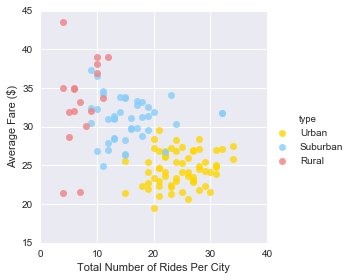
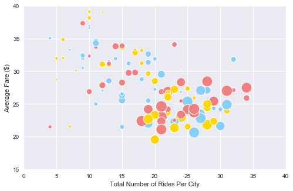
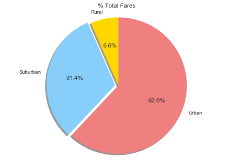
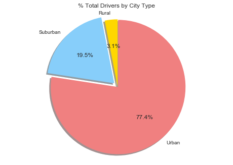
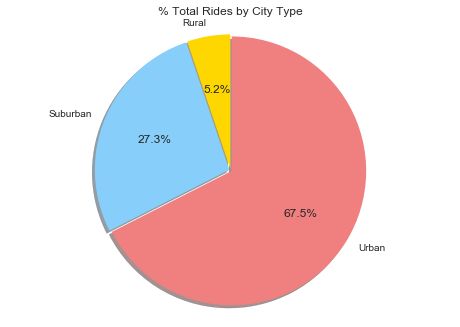

```python
## 3 observations at the end##
```


```python
import pandas as pd
import matplotlib.pyplot as plt
import seaborn as sns

ride_data_pd = pd.read_csv("ride_data.csv")
ride_data_pd.head()


```


<div>
<style>
    .dataframe thead tr:only-child th {
        text-align: right;
    }

    .dataframe thead th {
        text-align: left;
    }

    .dataframe tbody tr th {
        vertical-align: top;
    }
</style>
<table border="1" class="dataframe">
  <thead>
    <tr style="text-align: right;">
      <th></th>
      <th>city</th>
      <th>date</th>
      <th>fare</th>
      <th>ride_id</th>
    </tr>
  </thead>
  <tbody>
    <tr>
      <th>0</th>
      <td>Sarabury</td>
      <td>2016-01-16 13:49:27</td>
      <td>38.35</td>
      <td>5403689035038</td>
    </tr>
    <tr>
      <th>1</th>
      <td>South Roy</td>
      <td>2016-01-02 18:42:34</td>
      <td>17.49</td>
      <td>4036272335942</td>
    </tr>
    <tr>
      <th>2</th>
      <td>Wiseborough</td>
      <td>2016-01-21 17:35:29</td>
      <td>44.18</td>
      <td>3645042422587</td>
    </tr>
    <tr>
      <th>3</th>
      <td>Spencertown</td>
      <td>2016-07-31 14:53:22</td>
      <td>6.87</td>
      <td>2242596575892</td>
    </tr>
    <tr>
      <th>4</th>
      <td>Nguyenbury</td>
      <td>2016-07-09 04:42:44</td>
      <td>6.28</td>
      <td>1543057793673</td>
    </tr>
  </tbody>
</table>
</div>


```python
# example of how you make a copy of a dataframe using pandas
# new = old[['A', 'C', 'D']].copy()

#makes copy of original data frame to use for avg fare per city with only city and fare
# city_fare_only = ride_data_pd[["city", "fare"]].copy(deep = True)
# city_fare_only.head()

#uses the original data frame to calc the avg fare per city
avg_city_fare = ride_data_pd.groupby(["city"]).mean()["fare"]
avg_city_fare.head()
```


    city
    Alvarezhaven    23.928710
    Alyssaberg      20.609615
    Anitamouth      37.315556
    Antoniomouth    23.625000
    Aprilchester    21.981579
    Name: fare, dtype: float64


```python
#uses the copy of the dataframe from abover to get avg fare per city
# avg_city_fare = city_fare_only.groupby(["city"]).mean()["fare"]
# avg_city_fare.head()

```


```python
# Total Number of Rides Per City
total_city_rides = ride_data_pd.groupby(["city"]).count()["fare"]
total_city_rides.head()
```


    city
    Alvarezhaven    31
    Alyssaberg      26
    Anitamouth       9
    Antoniomouth    22
    Aprilchester    19
    Name: fare, dtype: int64


```python
# Importing city_data.csv
city_data_pd = pd.read_csv("city_data.csv")
city_data_pd.head()
type(city_data_pd)

```


    pandas.core.frame.DataFrame


```python
# Total Number of Drivers Per City
total_city_drivers = city_data_pd.groupby(["city"]).sum()["driver_count"]
total_city_drivers.head()
```


    city
    Alvarezhaven    21
    Alyssaberg      67
    Anitamouth      16
    Antoniomouth    21
    Aprilchester    49
    Name: driver_count, dtype: int64


```python
# #city type per city
# # Total Number of Drivers Per City
# type_per_city_df = city_data_pd.groupby(["city"])
# type_per_city_df.head()
# type(type_per_city_df)
```


```python
#make new data frame with 3 columns: 3 key variables from above
pyber_city_variables_df = pd.DataFrame({"Avg Fare per City": avg_city_fare,
                                  "Total # of Rides": total_city_rides,
                                  "Total Drivers per City": total_city_drivers})

pyber_city_variables_df.head()
# type(pyber_city_variables_df)

##we're gonna have to merge a city type table and the pyber comparison table since I can't pull the right 
##...data point into city type. I keep pulling in (city_name, [city]) into the list from the groupby if I do not function
```


<div>
<style>
    .dataframe thead tr:only-child th {
        text-align: right;
    }

    .dataframe thead th {
        text-align: left;
    }

    .dataframe tbody tr th {
        vertical-align: top;
    }
</style>
<table border="1" class="dataframe">
  <thead>
    <tr style="text-align: right;">
      <th></th>
      <th>Avg Fare per City</th>
      <th>Total # of Rides</th>
      <th>Total Drivers per City</th>
    </tr>
    <tr>
      <th>city</th>
      <th></th>
      <th></th>
      <th></th>
    </tr>
  </thead>
  <tbody>
    <tr>
      <th>Alvarezhaven</th>
      <td>23.928710</td>
      <td>31</td>
      <td>21</td>
    </tr>
    <tr>
      <th>Alyssaberg</th>
      <td>20.609615</td>
      <td>26</td>
      <td>67</td>
    </tr>
    <tr>
      <th>Anitamouth</th>
      <td>37.315556</td>
      <td>9</td>
      <td>16</td>
    </tr>
    <tr>
      <th>Antoniomouth</th>
      <td>23.625000</td>
      <td>22</td>
      <td>21</td>
    </tr>
    <tr>
      <th>Aprilchester</th>
      <td>21.981579</td>
      <td>19</td>
      <td>49</td>
    </tr>
  </tbody>
</table>
</div>


```python
##place index as a column
pyber_city_variables_df['city'] = pyber_city_variables_df.index
# pyber_city_variables_df.head()

pyber_city_variables_df = pyber_city_variables_df[['city', 'Avg Fare per City', 'Total # of Rides', 'Total Drivers per City']]
pyber_city_variables_df.head()
```


<div>
<style>
    .dataframe thead tr:only-child th {
        text-align: right;
    }

    .dataframe thead th {
        text-align: left;
    }

    .dataframe tbody tr th {
        vertical-align: top;
    }
</style>
<table border="1" class="dataframe">
  <thead>
    <tr style="text-align: right;">
      <th></th>
      <th>city</th>
      <th>Avg Fare per City</th>
      <th>Total # of Rides</th>
      <th>Total Drivers per City</th>
    </tr>
    <tr>
      <th>city</th>
      <th></th>
      <th></th>
      <th></th>
      <th></th>
    </tr>
  </thead>
  <tbody>
    <tr>
      <th>Alvarezhaven</th>
      <td>Alvarezhaven</td>
      <td>23.928710</td>
      <td>31</td>
      <td>21</td>
    </tr>
    <tr>
      <th>Alyssaberg</th>
      <td>Alyssaberg</td>
      <td>20.609615</td>
      <td>26</td>
      <td>67</td>
    </tr>
    <tr>
      <th>Anitamouth</th>
      <td>Anitamouth</td>
      <td>37.315556</td>
      <td>9</td>
      <td>16</td>
    </tr>
    <tr>
      <th>Antoniomouth</th>
      <td>Antoniomouth</td>
      <td>23.625000</td>
      <td>22</td>
      <td>21</td>
    </tr>
    <tr>
      <th>Aprilchester</th>
      <td>Aprilchester</td>
      <td>21.981579</td>
      <td>19</td>
      <td>49</td>
    </tr>
  </tbody>
</table>
</div>


```python
#resetting the index to have it merge with my other table. Would keep erroring if I kept index as city.
new_df = pyber_city_variables_df.reset_index(drop=True)
new_df.head()
```


<div>
<style>
    .dataframe thead tr:only-child th {
        text-align: right;
    }

    .dataframe thead th {
        text-align: left;
    }

    .dataframe tbody tr th {
        vertical-align: top;
    }
</style>
<table border="1" class="dataframe">
  <thead>
    <tr style="text-align: right;">
      <th></th>
      <th>city</th>
      <th>Avg Fare per City</th>
      <th>Total # of Rides</th>
      <th>Total Drivers per City</th>
    </tr>
  </thead>
  <tbody>
    <tr>
      <th>0</th>
      <td>Alvarezhaven</td>
      <td>23.928710</td>
      <td>31</td>
      <td>21</td>
    </tr>
    <tr>
      <th>1</th>
      <td>Alyssaberg</td>
      <td>20.609615</td>
      <td>26</td>
      <td>67</td>
    </tr>
    <tr>
      <th>2</th>
      <td>Anitamouth</td>
      <td>37.315556</td>
      <td>9</td>
      <td>16</td>
    </tr>
    <tr>
      <th>3</th>
      <td>Antoniomouth</td>
      <td>23.625000</td>
      <td>22</td>
      <td>21</td>
    </tr>
    <tr>
      <th>4</th>
      <td>Aprilchester</td>
      <td>21.981579</td>
      <td>19</td>
      <td>49</td>
    </tr>
  </tbody>
</table>
</div>


```python
##join the 2 tables "new_df" and original city_data_pd
city_plus_type_df = pd.merge(new_df, city_data_pd, on = "city")
city_plus_type_df.head()
```


<div>
<style>
    .dataframe thead tr:only-child th {
        text-align: right;
    }

    .dataframe thead th {
        text-align: left;
    }

    .dataframe tbody tr th {
        vertical-align: top;
    }
</style>
<table border="1" class="dataframe">
  <thead>
    <tr style="text-align: right;">
      <th></th>
      <th>city</th>
      <th>Avg Fare per City</th>
      <th>Total # of Rides</th>
      <th>Total Drivers per City</th>
      <th>driver_count</th>
      <th>type</th>
    </tr>
  </thead>
  <tbody>
    <tr>
      <th>0</th>
      <td>Alvarezhaven</td>
      <td>23.928710</td>
      <td>31</td>
      <td>21</td>
      <td>21</td>
      <td>Urban</td>
    </tr>
    <tr>
      <th>1</th>
      <td>Alyssaberg</td>
      <td>20.609615</td>
      <td>26</td>
      <td>67</td>
      <td>67</td>
      <td>Urban</td>
    </tr>
    <tr>
      <th>2</th>
      <td>Anitamouth</td>
      <td>37.315556</td>
      <td>9</td>
      <td>16</td>
      <td>16</td>
      <td>Suburban</td>
    </tr>
    <tr>
      <th>3</th>
      <td>Antoniomouth</td>
      <td>23.625000</td>
      <td>22</td>
      <td>21</td>
      <td>21</td>
      <td>Urban</td>
    </tr>
    <tr>
      <th>4</th>
      <td>Aprilchester</td>
      <td>21.981579</td>
      <td>19</td>
      <td>49</td>
      <td>49</td>
      <td>Urban</td>
    </tr>
  </tbody>
</table>
</div>


```python
##using seaborn for the plot. Can't get my bubbles to change shape though
sns.lmplot(x='Total # of Rides', y='Avg Fare per City', data=city_plus_type_df, fit_reg=False, size=4, aspect=1, hue='type', palette=dict(Urban="Gold", Suburban="lightskyblue", Rural="lightcoral"))   # Color by evolution stage)
# Tweak using Matplotlib
plt.xlim(0, 40)
plt.ylim(15, 45)
xlabel('Total Number of Rides Per City')
ylabel('Average Fare ($)')

show()
```





```python
### This is using straight matplotlib and pyplot alowwing me to change bubble size!
#BUT bubble colors won't correlate to correct city_type like above.

fig = plt.figure()
ax = fig.add_subplot(111, aspect='equal')

colors = ["Gold", "lightskyblue", "lightcoral"]
# colors = [Urban="Gold", Suburban="lightskyblue", Rural="lightcoral"]
ax.scatter(city_plus_type_df['Total # of Rides'], city_plus_type_df['Avg Fare per City'],c=colors, s=city_plus_type_df['Total Drivers per City']*5, linewidths=-1, edgecolor='w')

# # Create a legend
# lgnd = plt.legend(city_plus_type_df['type'],fontsize="small", mode="Expanded", 
#                   numpoints=3, scatterpoints=1, 
#                   loc="best", title="City Types", 
#                   labelspacing=0.5)

plt.xlim(0,40)
plt.ylim(15, 40)
xlabel('Total Number of Rides Per City')
ylabel('Average Fare ($)')


plt.show()
```





```python
##just for viewing purposes
city_plus_type_df.head()
```


<div>
<style>
    .dataframe thead tr:only-child th {
        text-align: right;
    }

    .dataframe thead th {
        text-align: left;
    }

    .dataframe tbody tr th {
        vertical-align: top;
    }
</style>
<table border="1" class="dataframe">
  <thead>
    <tr style="text-align: right;">
      <th></th>
      <th>city</th>
      <th>Avg Fare per City</th>
      <th>Total # of Rides</th>
      <th>Total Drivers per City</th>
      <th>driver_count</th>
      <th>type</th>
    </tr>
  </thead>
  <tbody>
    <tr>
      <th>0</th>
      <td>Alvarezhaven</td>
      <td>23.928710</td>
      <td>31</td>
      <td>21</td>
      <td>21</td>
      <td>Urban</td>
    </tr>
    <tr>
      <th>1</th>
      <td>Alyssaberg</td>
      <td>20.609615</td>
      <td>26</td>
      <td>67</td>
      <td>67</td>
      <td>Urban</td>
    </tr>
    <tr>
      <th>2</th>
      <td>Anitamouth</td>
      <td>37.315556</td>
      <td>9</td>
      <td>16</td>
      <td>16</td>
      <td>Suburban</td>
    </tr>
    <tr>
      <th>3</th>
      <td>Antoniomouth</td>
      <td>23.625000</td>
      <td>22</td>
      <td>21</td>
      <td>21</td>
      <td>Urban</td>
    </tr>
    <tr>
      <th>4</th>
      <td>Aprilchester</td>
      <td>21.981579</td>
      <td>19</td>
      <td>49</td>
      <td>49</td>
      <td>Urban</td>
    </tr>
  </tbody>
</table>
</div>


```python
## percent of Total Rides by City Type
total_rides_city_type = city_plus_type_df.groupby(["type"]).sum()["Total # of Rides"]/(sum([city_plus_type_df["Total # of Rides"]]))*100
total_rides_city_type.head()

```


    type
    Rural        5.193187
    Suburban    27.295388
    Urban       67.511425
    Name: Total # of Rides, dtype: float64


```python
## percent of Total Fares by City Type
total_drivers_city_type = city_plus_type_df.groupby(["type"]).sum()["Total Drivers per City"]/(sum([city_plus_type_df["Total Drivers per City"]]))*100
total_drivers_city_type.head()
```


    type
    Rural        3.088803
    Suburban    19.483219
    Urban       77.427977
    Name: Total Drivers per City, dtype: float64


```python
## percent of Total Drivers by City Type
##going to have to get original table with fares and group them by type and get 
#uses the original data frame to calc the avg fare per city
fare_per_city = ride_data_pd.groupby(["city"]).sum()["fare"]
type(percent_drivers_type)

#make new data frame
fare_per_city = pd.DataFrame({"total fare per city": fare_per_city})
fare_per_city.head()
```


<div>
<style>
    .dataframe thead tr:only-child th {
        text-align: right;
    }

    .dataframe thead th {
        text-align: left;
    }

    .dataframe tbody tr th {
        vertical-align: top;
    }
</style>
<table border="1" class="dataframe">
  <thead>
    <tr style="text-align: right;">
      <th></th>
      <th>total fare per city</th>
    </tr>
    <tr>
      <th>city</th>
      <th></th>
    </tr>
  </thead>
  <tbody>
    <tr>
      <th>Alvarezhaven</th>
      <td>741.79</td>
    </tr>
    <tr>
      <th>Alyssaberg</th>
      <td>535.85</td>
    </tr>
    <tr>
      <th>Anitamouth</th>
      <td>335.84</td>
    </tr>
    <tr>
      <th>Antoniomouth</th>
      <td>519.75</td>
    </tr>
    <tr>
      <th>Aprilchester</th>
      <td>417.65</td>
    </tr>
  </tbody>
</table>
</div>


```python
##place index as a column
fare_per_city['city'] = fare_per_city.index
fare_per_city.head()
```


<div>
<style>
    .dataframe thead tr:only-child th {
        text-align: right;
    }

    .dataframe thead th {
        text-align: left;
    }

    .dataframe tbody tr th {
        vertical-align: top;
    }
</style>
<table border="1" class="dataframe">
  <thead>
    <tr style="text-align: right;">
      <th></th>
      <th>total fare per city</th>
      <th>city</th>
    </tr>
    <tr>
      <th>city</th>
      <th></th>
      <th></th>
    </tr>
  </thead>
  <tbody>
    <tr>
      <th>Alvarezhaven</th>
      <td>741.79</td>
      <td>Alvarezhaven</td>
    </tr>
    <tr>
      <th>Alyssaberg</th>
      <td>535.85</td>
      <td>Alyssaberg</td>
    </tr>
    <tr>
      <th>Anitamouth</th>
      <td>335.84</td>
      <td>Anitamouth</td>
    </tr>
    <tr>
      <th>Antoniomouth</th>
      <td>519.75</td>
      <td>Antoniomouth</td>
    </tr>
    <tr>
      <th>Aprilchester</th>
      <td>417.65</td>
      <td>Aprilchester</td>
    </tr>
  </tbody>
</table>
</div>


```python
#resetting the index to have it merge with my other table.
fare_per_city = fare_per_city.reset_index(drop=True)
fare_per_city.head()

fare_per_city = fare_per_city[['city', 'total fare per city']]
fare_per_city.head()
```


<div>
<style>
    .dataframe thead tr:only-child th {
        text-align: right;
    }

    .dataframe thead th {
        text-align: left;
    }

    .dataframe tbody tr th {
        vertical-align: top;
    }
</style>
<table border="1" class="dataframe">
  <thead>
    <tr style="text-align: right;">
      <th></th>
      <th>city</th>
      <th>total fare per city</th>
    </tr>
  </thead>
  <tbody>
    <tr>
      <th>0</th>
      <td>Alvarezhaven</td>
      <td>741.79</td>
    </tr>
    <tr>
      <th>1</th>
      <td>Alyssaberg</td>
      <td>535.85</td>
    </tr>
    <tr>
      <th>2</th>
      <td>Anitamouth</td>
      <td>335.84</td>
    </tr>
    <tr>
      <th>3</th>
      <td>Antoniomouth</td>
      <td>519.75</td>
    </tr>
    <tr>
      <th>4</th>
      <td>Aprilchester</td>
      <td>417.65</td>
    </tr>
  </tbody>
</table>
</div>


```python
## make dataframe with the other 2 datapoints then merge with 'city_plus_type_df'. then calculate % total fares by city type
##then create new dataframe with those 3 values and do your pie charts

# #adds total fare per city column
# city_plus_type_df['total fare per city'] = fare_per_city['total fare per city']
# city_plus_type_df.head()

#merges tables per city which is probably better than just adding a column
city_plus_type_df = pd.merge(city_plus_type_df, fare_per_city, on = "city")
city_plus_type_df.head()

```


<div>
<style>
    .dataframe thead tr:only-child th {
        text-align: right;
    }

    .dataframe thead th {
        text-align: left;
    }

    .dataframe tbody tr th {
        vertical-align: top;
    }
</style>
<table border="1" class="dataframe">
  <thead>
    <tr style="text-align: right;">
      <th></th>
      <th>city</th>
      <th>Avg Fare per City</th>
      <th>Total # of Rides</th>
      <th>Total Drivers per City</th>
      <th>driver_count</th>
      <th>type</th>
      <th>total fare per city</th>
    </tr>
  </thead>
  <tbody>
    <tr>
      <th>0</th>
      <td>Alvarezhaven</td>
      <td>23.928710</td>
      <td>31</td>
      <td>21</td>
      <td>21</td>
      <td>Urban</td>
      <td>741.79</td>
    </tr>
    <tr>
      <th>1</th>
      <td>Alyssaberg</td>
      <td>20.609615</td>
      <td>26</td>
      <td>67</td>
      <td>67</td>
      <td>Urban</td>
      <td>535.85</td>
    </tr>
    <tr>
      <th>2</th>
      <td>Anitamouth</td>
      <td>37.315556</td>
      <td>9</td>
      <td>16</td>
      <td>16</td>
      <td>Suburban</td>
      <td>335.84</td>
    </tr>
    <tr>
      <th>3</th>
      <td>Antoniomouth</td>
      <td>23.625000</td>
      <td>22</td>
      <td>21</td>
      <td>21</td>
      <td>Urban</td>
      <td>519.75</td>
    </tr>
    <tr>
      <th>4</th>
      <td>Aprilchester</td>
      <td>21.981579</td>
      <td>19</td>
      <td>49</td>
      <td>49</td>
      <td>Urban</td>
      <td>417.65</td>
    </tr>
  </tbody>
</table>
</div>


```python
total_fare_city_type = city_plus_type_df.groupby(["type"]).sum()["total fare per city"]/(sum([city_plus_type_df["total fare per city"]]))*100
total_fare_city_type.head()
```


    type
    Rural        6.579786
    Suburban    31.445750
    Urban       61.974463
    Name: total fare per city, dtype: float64


```python
##make new dataframe for pie charts with rural, suburban and urban 
pyber_city_type_variables = pd.DataFrame({"% Total Fares": total_fare_city_type,
                                  "% Total Rides by City Type": total_rides_city_type,
                                  "% Total Drivers by City Type": total_drivers_city_type})

pyber_city_type_variables.head()
```


<div>
<style>
    .dataframe thead tr:only-child th {
        text-align: right;
    }

    .dataframe thead th {
        text-align: left;
    }

    .dataframe tbody tr th {
        vertical-align: top;
    }
</style>
<table border="1" class="dataframe">
  <thead>
    <tr style="text-align: right;">
      <th></th>
      <th>% Total Drivers by City Type</th>
      <th>% Total Fares</th>
      <th>% Total Rides by City Type</th>
    </tr>
    <tr>
      <th>type</th>
      <th></th>
      <th></th>
      <th></th>
    </tr>
  </thead>
  <tbody>
    <tr>
      <th>Rural</th>
      <td>3.088803</td>
      <td>6.579786</td>
      <td>5.193187</td>
    </tr>
    <tr>
      <th>Suburban</th>
      <td>19.483219</td>
      <td>31.445750</td>
      <td>27.295388</td>
    </tr>
    <tr>
      <th>Urban</th>
      <td>77.427977</td>
      <td>61.974463</td>
      <td>67.511425</td>
    </tr>
  </tbody>
</table>
</div>


```python
##turn the index to zero and move the current index "type" to a column. If I change drop to False I don't have to rearrange columns
pyber_city_type_variables = pyber_city_type_variables.reset_index(drop=False)
pyber_city_type_variables.head()
```


<div>
<style>
    .dataframe thead tr:only-child th {
        text-align: right;
    }

    .dataframe thead th {
        text-align: left;
    }

    .dataframe tbody tr th {
        vertical-align: top;
    }
</style>
<table border="1" class="dataframe">
  <thead>
    <tr style="text-align: right;">
      <th></th>
      <th>type</th>
      <th>% Total Drivers by City Type</th>
      <th>% Total Fares</th>
      <th>% Total Rides by City Type</th>
    </tr>
  </thead>
  <tbody>
    <tr>
      <th>0</th>
      <td>Rural</td>
      <td>3.088803</td>
      <td>6.579786</td>
      <td>5.193187</td>
    </tr>
    <tr>
      <th>1</th>
      <td>Suburban</td>
      <td>19.483219</td>
      <td>31.445750</td>
      <td>27.295388</td>
    </tr>
    <tr>
      <th>2</th>
      <td>Urban</td>
      <td>77.427977</td>
      <td>61.974463</td>
      <td>67.511425</td>
    </tr>
  </tbody>
</table>
</div>


```python
## Percent of Total Fares

fig = plt.figure()
ax = fig.add_subplot(111)

##going to use this for my labels
city_types = pyber_city_type_variables['type']

#colors and how far away to move each widget
colors = ["Gold", "lightskyblue", "lightcoral"]
explode = (0, 0.05, 0)

ax.set_title("% of Total Fares by City Type")
ax.pie(pyber_city_type_variables['% Total Fares'], labels=city_types,explode=explode, colors=colors,
       autopct="%1.1f%%", shadow=True, startangle=90)
ax.axis("equal")

plt.show()
```





```python
## Percent Total Drivers by city

fig = plt.figure()
ax = fig.add_subplot(111)

# use for the label
city_types = pyber_city_type_variables['type']

#colors and how far away to move each widget
colors = ["Gold", "lightskyblue", "lightcoral"]
explode = (0, 0.07, 0.01)

ax.set_title("% Total Drivers by City Type")
ax.pie(pyber_city_type_variables['% Total Drivers by City Type'],labels=city_types, explode=explode, colors=colors,
       autopct="%1.1f%%", shadow=True, startangle=90)
ax.axis("equal")

plt.show()
```





```python
## Percent Total by City Type

fig = plt.figure()
ax = fig.add_subplot(111)

#gonna use for the label
city_types = pyber_city_type_variables['type']

#colors and how far away to move each widget
colors = ["Gold", "lightskyblue", "lightcoral"]
explode = (0.01, 0.01, 0.01)

ax.set_title("% of Total Rides by City Type")
ax.pie(pyber_city_type_variables['% Total Rides by City Type'],labels=city_types, colors=colors, explode=explode,
       autopct="%1.1f%%", shadow=True, startangle=90)
ax.axis("equal")

plt.show()
```





```python
# ##3 observations made from just looking at the data and what I would want to analyze more##

# 1. While there are less rides in general rural areas than urban. 
# Fares are still on par and in general look to be above average than the urban areas
# Though rural city types still make up a small percentage of the overall total combined fares of all city types.

#2. The suburban market seems to be quite lucrative for drivers. While the suburban city type makes up 27% of total rides and 31.4% of Total fares
## Only 19% of the total driver population drives in suburban cities areas while the average fare price looks to be slightly abover the urban average.

#3. Urban areas seem to be oversatturated by the amount of available drivers and suburban and rural areas need a bit more to meet demand.
##Urban areas made up 67.5% of total rides but also has 77.4% of drivers.
##Suburban areas made up 27.3% of total rides but also has 19.5% of drivers.
##Rural areas made up up 5.2% of total rides but also has 3.1% of drivers.
```
